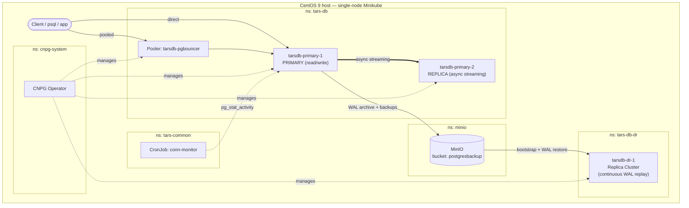

# TARS PostgreSQL — CloudNativePG Implementation (CentOS 9 / Minikube)
[](https://github.com/postgreshelp/edb-cnpg)
> This is the **community CNPG image** variant. Need EDB-supported images instead (EDB Postgres
> Advanced Server / EDB's hardened community-PG build)? Same architecture, same scripts, three
> manifest fields swapped — see [`postgreshelp/edb-cnpg`](https://github.com/postgreshelp/edb-cnpg).

> **8GB laptop POC profile:** The repository is pre-sized for a small dev laptop: Minikube defaults to 4 CPUs / 5Gi RAM / 40Gi disk, PostgreSQL data PVCs are 8Gi, PostgreSQL memory is reduced to a POC-safe profile, PgBouncer is 128Mi/256Mi, and MinIO uses a 5Gi PVC. These are intentionally different from the production TARS sizing; restore production values as a separate hardening task. You can override Minikube sizing with `MINIKUBE_CPUS`, `MINIKUBE_MEMORY`, and `MINIKUBE_DISK`.


POC implementation of the TARS PostgreSQL architecture doc, rebuilt on
**CloudNativePG (CNPG)**, the CNCF Kubernetes-native PostgreSQL operator, for testing on a
**CentOS 9** host via Minikube. The POC pins CloudNativePG 1.30.0 and uses the Barman Cloud CNPG-I plugin for object-store backup/restore. Read `docs/01-architecture-theory.md` first — it explains exactly
how each TARS component (Crunchy PGO, Patroni, pgBackRest, pgBouncer) maps onto CNPG so you know
*why* each manifest below is shaped the way it is, not just what to type.

## What you end up with

- A 2-instance CNPG `Cluster` (`tarsdb-primary`, namespace `tars-db`) — primary + async streaming
  replica, PostgreSQL 15.6, the TARS §6.2 parameters translated to a laptop-safe POC profile.
- Self-hosted **MinIO** (namespace `minio`) as the S3-compatible target for Barman Cloud, bucket
  `postgresbackup` — same bucket name as the real TARS platform.
- Continuous WAL archiving + weekly full backups, 14-day PITR retention, matching the TARS backup intent.
- A **DR replica cluster** (`tarsdb-dr`, namespace `tars-db-dr`) — bootstraps from and continuously
  replays WAL from the same MinIO bucket, promotable per `docs/04-runbooks-sop.md` SOP-3.
- A **Pooler** (pgBouncer, session mode) in front of the primary, matching TARS §5.
- A connection-threshold alert + idle-session reaper CronJob, matching TARS §8.
- The same authors/books/test schema + 100k-row Faker load as your original take-home assignment,
  retargeted at this stack, so you can validate replication/DR/PITR end-to-end.

Read `docs/02-backup-dr-theory.md` and `docs/03-connection-pooling-theory.md` for the reasoning
behind the backup and pooling design before you run SOPs against a real environment.
**`docs/06-architecture-diagrams.md`** has one diagram per module (primary HA, backup/DR,
pooling, monitoring) plus flowcharts for exactly what `one-click-deploy.sh` and `teardown.sh` do.

---
## Architecture at a glance

Everything runs in one Minikube node, split across five namespaces. Full breakdown, per-module
diagrams, and the setup/teardown flowcharts are in `docs/06-architecture-diagrams.md` — this is
just the one to keep in your head:



---
## POC resource sizing

The one-click Minikube setup defaults to **4 vCPU / 5 GiB RAM / 40 GiB disk** for an **8GB-RAM laptop**. PostgreSQL, PgBouncer, MinIO, and PVCs are also reduced to a laptop-safe POC profile. Override `MINIKUBE_CPUS`, `MINIKUBE_MEMORY`, and `MINIKUBE_DISK` before starting Minikube if your dev host differs.

## One-click deploy

On a fresh CentOS 9 host, as root:

```bash
unzip tars-cnpg-centos9.zip
cd tars-cnpg-centos9
./one-click-deploy.sh                     # full unattended install
./one-click-deploy.sh --checkpoint        # pause after each phase, show status, wait for Enter
./one-click-deploy.sh --with-test-data    # also loads schema + 100k Faker rows at the end
./one-click-deploy.sh --with-edb          # also sets up EDB registry access (see below)
```

Flags combine freely, e.g. `./one-click-deploy.sh --checkpoint --with-edb --with-test-data`.

This runs every step in `## Step-by-step implementation` below in order, unattended:
OS prep → Docker → Minikube/kubectl → CNPG operator → **random secret generation** → MinIO →
bucket creation → primary HA cluster → pooler → DR replica cluster → connection monitor →
(optionally) test data. It is idempotent — safe to re-run after a partial failure; it skips
steps that already succeeded and retries transient failures (e.g. MinIO not quite ready yet)
automatically. Progress streams to the terminal and the full output is saved to
`one-click-deploy.log`.

**Passwords are never placeholders here.** `generate-secrets.sh` (called automatically as part of
the one-click flow, step 5) generates strong random passwords for MinIO, the PostgreSQL
superuser, and the app user, renders the real Secret manifests from their `.template` files, and
writes everything to `credentials.txt` in the repo root (`chmod 600`, git-ignored). That file is
the one thing you need to save somewhere safe after a run — nothing else needs editing.

Already have Docker/Minikube/kubectl from a previous attempt? `./one-click-deploy.sh
--skip-os-prep` skips straight to the CNPG/MinIO/cluster steps.

**`--checkpoint` mode** pauses after every phase — OS prereqs, Docker, Minikube, the CNPG
operator, secrets, MinIO, the bucket, the primary cluster, the pooler, the DR cluster, the
monitor, and (if enabled) the test data load — prints the actual status output for that phase
(`kubectl get`/`kubectl cnpg status`, not just "done"), and waits for you to hit Enter before
moving on. Ctrl+C at any checkpoint stops cleanly there; re-running afterwards (even without
`--checkpoint`) picks up from where the already-applied resources leave off, since every step is
idempotent. Use it the first time you run this, or after any change to the manifests; skip it
once you trust the pipeline.

**`--with-edb`: optional EDB image test path.** This script cannot obtain EDB registry
credentials for you — that has to come from your own EDB account (subscription/registry access
page on enterprisedb.com); there's no API for a script to complete that step. What `--with-edb`
*does* automate is everything after you have a username/token: it runs
`scripts/setup-edb-registry.sh`, which interactively prompts for your EDB registry host/username/
token (input hidden, never logged or written to disk) and creates the resulting
`imagePullSecret` in both `tars-db` and `tars-db-dr`. By default the clusters still run the
community CNPG image (`ghcr.io/cloudnative-pg/postgresql:15.6`) — to actually switch to an EDB
image, edit `imageName` and uncomment the `imagePullSecrets` block already scaffolded (commented)
in `manifests/cluster/cluster-primary.yaml` and `manifests/dr/cluster-dr-replica.yaml`, then
re-apply. `setup-edb-registry.sh` prints these exact instructions at the end of its run.

### Example output (real run, trimmed)

```
[19:56:09] STEP 1/12 — OS prerequisites
[19:56:31] STEP 2/12 — Docker
  docker already installed, skipping
[19:56:31] STEP 3/12 — Minikube + kubectl + namespaces
[19:57:43] STEP 4/12 — CloudNativePG operator
[20:00:06] STEP 5/12 — Generating strong random secrets (see ../credentials.txt afterwards)
[20:00:06] STEP 6/12 — MinIO object store
[20:00:34] STEP 7/12 — Creating the postgresbackup bucket
[20:00:46] STEP 8/12 — Primary HA Cluster (this can take several minutes on first run)
[20:03:19] STEP 9/12 — pgBouncer Pooler
[20:03:36] STEP 10/12 — DR replica cluster
[20:05:52] STEP 11/12 — Connection monitor (threshold alert + idle-session reaper CronJob)
[20:05:53] STEP 12/12 — Loading schema + 100k test rows (this takes a few minutes)

================================================================
 Deployment complete.
   Credentials : /root/tars-cnpg-centos9-8gb-poc/credentials.txt
   Full log    : /root/tars-cnpg-centos9-8gb-poc/one-click-deploy.log
================================================================
```
End to end (already-provisioned host, skip OS/Docker steps): roughly **9-10 minutes** to a
healthy primary + pooler + DR + monitor, plus a few more minutes for `--with-test-data`'s 100k rows.

---
## Teardown

```bash
./teardown.sh              # deletes tarsdb-primary, tarsdb-dr, pooler, MinIO, conn-monitor —
                            # keeps the Minikube VM itself and credentials.txt
./teardown.sh --full       # same, then also `minikube delete`s the VM — next setup starts
                            # completely from scratch (fresh secrets, fresh cluster)
```

It asks for confirmation before touching anything:

```
This deletes tarsdb-primary, tarsdb-dr, the pooler, MinIO, and the conn-monitor CronJob. Continue? [y/N] y
objectstore.barmancloud.cnpg.io "tarsdb-primary-store" deleted
cluster.postgresql.cnpg.io "tarsdb-primary" deleted
cluster.postgresql.cnpg.io "tarsdb-dr" deleted
pooler.postgresql.cnpg.io "tarsdb-pgbouncer" deleted
scheduledbackup.postgresql.cnpg.io "tarsdb-weekly-full" deleted
cronjob.batch "conn-monitor" deleted
deployment.apps "minio" deleted
persistentvolumeclaim "minio-data" deleted
Teardown complete.
```

**Known gap:** `teardown.sh` needs a *reachable* Kubernetes API server — every delete is a live
`kubectl` call under `set -euo pipefail`. If Minikube is already `Stopped` (not just idle,
literally stopped — check with `minikube status`), `kubectl` can't connect and the script fails on
the very first delete instead of degrading gracefully. In that state, either `minikube start`
first (so `teardown.sh` can do its resource-by-resource cleanup and log what it removed), or skip
straight to `minikube delete` — same end result, no per-resource log. See `docs/06-architecture-diagrams.md` §7 for the full decision flow.

If you'd rather run it by hand — to understand or customize each stage — the identical steps are
broken out individually below.

---
## Repository layout

```
tars-cnpg-centos9/
├── README.md                          <- you are here
├── one-click-deploy.sh                <- unattended end-to-end install, see above
├── teardown.sh                        <- tears the whole stack back down
├── .gitignore                         <- keeps generated secrets/credentials.txt out of git
├── docs/
│   ├── 01-architecture-theory.md      theory: CNPG vs Crunchy PGO, topology, replication concepts
│   ├── 02-backup-dr-theory.md         theory: PITR, Barman Cloud, replica-cluster DR, failback
│   ├── 03-connection-pooling-theory.md theory: pool modes, direct-vs-pooled routing, TLS, alerting
│   ├── 04-runbooks-sop.md             SOPs: health check, failover, DR promotion, failback,
│   │                                   PITR restore, backup verification, connection incidents
│   ├── 05-poc-fixes.md                changelog of POC-specific fixes vs. earlier revisions
│   └── 06-architecture-diagrams.md    one Mermaid diagram per module + setup/teardown flowcharts
├── scripts/
│   ├── 00-prereqs-centos9.sh          OS prep (sysctl, firewalld, base packages)
│   ├── 01-install-docker.sh           Docker CE (Minikube driver)
│   ├── 02-install-minikube-kubectl.sh Minikube + kubectl + namespaces
│   ├── 03-install-cnpg-operator.sh    CloudNativePG operator + kubectl-cnpg plugin
│   ├── generate-secrets.sh            random passwords -> real Secret manifests + credentials.txt
│   ├── setup-edb-registry.sh          interactive: wires EDB registry creds -> imagePullSecret
│   ├── 04-deploy-minio.sh             MinIO object store
│   ├── 05-create-minio-buckets.sh     creates the postgresbackup bucket
│   ├── 06-deploy-primary-cluster.sh   deploys tarsdb-primary
│   ├── 07-deploy-pooler.sh            deploys the pgBouncer Pooler
│   ├── 08-deploy-dr-replica-cluster.sh deploys tarsdb-dr (simulated DR site)
│   ├── 09-load-test-data.sh           schema + 100k-row Faker load
│   └── monitor/conn_monitor.py        connection threshold alert + idle-session reaper
├── manifests/
│   ├── minio/                         MinIO PVC/Deployment/Service
│   ├── secrets/                       .template files rendered by generate-secrets.sh into the
│   │                                  real (git-ignored) Secret manifests it applies
│   ├── cluster/                       cluster-primary.yaml, scheduledbackup.yaml
│   ├── backup/                        Barman Cloud CNPG-I ObjectStore manifests
│   ├── pooler/                        pooler-pgbouncer.yaml
│   ├── dr/                            cluster-dr-replica.yaml + failback template
│   └── monitoring/                    conn-monitor CronJob + Secret template + PodMonitor note
├── sql/create_tables.sql              authors/books/test schema
├── fake_inserts.py                    100k-row Faker loader
└── firewall/firewall-rules.sh         firewalld ports for CentOS 9
```

---
## Step-by-step implementation

Run everything as `root` (or `sudo`) on your CentOS 9 host unless noted otherwise.

### 1. OS prep
```bash
cd scripts
./00-prereqs-centos9.sh
reboot     # recommended — sysctl/kernel module changes apply cleanly after a reboot
```

### 2. Docker (Minikube driver)
```bash
cd scripts
./01-install-docker.sh
# log out/in (or `newgrp docker`) so your user picks up docker-group membership
```

### 3. Minikube + kubectl + namespaces
```bash
./02-install-minikube-kubectl.sh
kubectl get nodes         # should show one Ready node
kubectl get ns            # tars-db, tars-db-dr, minio, tars-common should all exist
```

### 4. CloudNativePG operator
```bash
./03-install-cnpg-operator.sh
kubectl get pods -n cnpg-system          # controller manager should be Running
kubectl cnpg version                     # confirms the plugin installed correctly
```

### 5. Generate real credentials, then deploy MinIO (backup object store)
```bash
./generate-secrets.sh          # writes real Secret manifests + ../credentials.txt (save this file)
./04-deploy-minio.sh
./05-create-minio-buckets.sh
```
`generate-secrets.sh` renders `manifests/secrets/*.yaml` (git-ignored) from their `.template`
counterparts with strong random passwords — nothing here ships with a real credential baked in,
and nothing needs manual editing. Re-running it rotates all three passwords; if you do that after
the cluster is already up, you'll also need to restart the affected pods to pick up the change.

### 6. Primary HA cluster
```bash
./06-deploy-primary-cluster.sh
kubectl cnpg status tarsdb-primary -n tars-db
```
Expect to see one `primary` instance and one `replica` instance, both `Running`, replica showing
`streaming` (not `catching up`).

### 7. Connection pooler
```bash
./07-deploy-pooler.sh
kubectl get svc -n tars-db tarsdb-pgbouncer     # note: no "-rw" suffix — the Pooler's
                                                 # Service takes the Pooler object's name as-is
```

### 8. DR replica cluster (simulated, same Minikube)
```bash
./08-deploy-dr-replica-cluster.sh
kubectl cnpg status tarsdb-dr -n tars-db-dr
```
This cluster is **read-only** and stays in continuous recovery from MinIO. Do not treat it as a
normal replica to write to — see `docs/04-runbooks-sop.md` SOP-3 for the promotion procedure,
which is deliberately manual to prevent split-brain, matching TARS §4.1.

### 9. Connection monitor
`generate-secrets.sh` (step 5) already rendered `manifests/monitoring/conn-monitor-secret.yaml`
using the superuser password it generated — nothing to edit here either:
```bash
kubectl create configmap conn-monitor-script \
  --from-file=conn_monitor.py=../scripts/monitor/conn_monitor.py \
  -n tars-common
kubectl apply -f ../manifests/monitoring/conn-monitor-secret.yaml
kubectl apply -f ../manifests/monitoring/conn-monitor-cronjob.yaml
kubectl get cronjob -n tars-common
```

### 10. Load test data and validate replication/DR
```bash
cd ../../scripts
./09-load-test-data.sh
```
Then confirm the data reached both the local replica and the DR cluster:
```bash
kubectl exec -it -n tars-db tarsdb-primary-2 -- psql -U tars_admin -d tars -c "select count(*) from books;"
kubectl exec -it -n tars-db-dr tarsdb-dr-1   -- psql -U tars_admin -d tars -c "select count(*) from books;"
```
The DR count will lag slightly behind (it replays WAL from the object store, not live streaming —
see `docs/02-backup-dr-theory.md`), so re-check after a minute if it's short.

### 11. Firewall (only if exposing ports beyond the host itself)
```bash
cd ../firewall
./firewall-rules.sh
```

---
## Verify the deployment (sample output from a real run)

See [docs/07-sample-checkpoint-verify-run.md](docs/07-sample-checkpoint-verify-run.md) for an
annotated walkthrough of a full `--checkpoint` deploy plus these verify commands, with a one-liner
explaining what each block of output proves.

```bash
kubectl cnpg status tarsdb-primary -n tars-db
```
```
Cluster Summary
Name                     tars-db/tarsdb-primary
Primary instance:        tarsdb-primary-1
Status:                  Cluster in healthy state
Instances:               2
Ready instances:         2

Continuous Backup status (Barman Cloud Plugin)
Working WAL archiving:        OK
WALs waiting to be archived:  0
Last Failed WAL:              -

Streaming Replication status
Name              Sent LSN   Write LSN  Flush LSN  Replay LSN  State      Sync State  Sync Priority
tarsdb-primary-2  0/6A7A570  0/6A7A570  0/6A7A570  0/6A7A570   streaming  async       0

Instances status
Name              Replication role  Status  QoS        Node
tarsdb-primary-1  Primary           OK      Burstable  minikube
tarsdb-primary-2  Standby (async)   OK      Burstable  minikube
```

```bash
kubectl cnpg status tarsdb-dr -n tars-db-dr
```
```
Replica Cluster Summary
Name                     tars-db-dr/tarsdb-dr
Designated primary:      tarsdb-dr-1
Source cluster:          primary-object-store
Status:                  Cluster in healthy state
Instances:               1
Ready instances:         1
```

```bash
kubectl get pooler,svc -n tars-db tarsdb-pgbouncer
kubectl get cronjob -n tars-common
kubectl exec -n tars-db tarsdb-primary-1 -- psql -U postgres -d tars \
  -c "select (select count(*) from authors) authors, (select count(*) from books) books;"
```
```
NAME               AGE   CLUSTER          TYPE   PHASE
tarsdb-pgbouncer   8m    tarsdb-primary   rw     active

NAME           SCHEDULE       SUSPEND   ACTIVE   LAST SCHEDULE
conn-monitor   */10 * * * *   False     0        84s

 authors | books
---------+--------
    1000 | 100000
```

All four checks passing is what "everything is working" looks like end to end: primary+replica
both `Ready`, WAL archiving `OK`, DR cluster `healthy`, pooler `active`, conn-monitor firing on
schedule, and the 100k-row test load intact.

---
## Troubleshooting

**`fake_inserts.py` fails with `password authentication failed for user "tars_admin"`, or the
port-forward errors with `address already in use`.** Something else on the host is already
listening on port 5432 — commonly a native/system PostgreSQL install (`ss -ltnp | grep 5432` will
show it). `scripts/09-load-test-data.sh` forwards to local port **`15432`** by default specifically
to avoid this collision (override with `TARS_PGPORT=<port> ./09-load-test-data.sh` if `15432` is
also taken); `fake_inserts.py` reads the same `TARS_PGPORT` env var. If you hit this on an older
checkout, update both files — do not kill whatever else owns port 5432, since it's very likely
unrelated to this POC and may be someone else's data.

**`teardown.sh` fails immediately on the first `kubectl delete` with a connection error.**
Minikube itself is `Stopped`, not just idle — check `minikube status`. `teardown.sh` needs a live
API server; either `minikube start` first, or skip straight to `minikube delete` for the same end
result (see `docs/06-architecture-diagrams.md` §7).

**`07-deploy-pooler.sh` fails with `Error from server (NotFound): deployments.apps
"tarsdb-pgbouncer" not found`.** The CNPG operator creates the Pooler's backing Deployment
asynchronously after the `Pooler` CR is applied — it can take a few seconds to appear. The script
already polls for up to 60s before calling `kubectl rollout status`; if your host is slow enough
to exceed that, just re-run `./07-deploy-pooler.sh` (idempotent) or raise the retry count at the
top of the script.

**Disk pressure during install.** The Minikube VM (docker driver) doesn't pre-allocate its
`--disk-size`; it grows with actual usage, typically 3-4GB for this POC's workload. Still, check
`df -h /` has a few GB headroom before running `one-click-deploy.sh` on an already-tight host.

---
## Operating this platform

Once deployed, all day-2 operations — health checks, failover, DR promotion, failback, PITR
restores, backup verification, and connection-threshold incident response — are documented as
numbered SOPs in **`docs/04-runbooks-sop.md`**. Do not improvise DR promotion/failback commands
outside that runbook; the ordering (fence → confirm → promote) exists specifically to prevent
split-brain, per TARS §4.1.

## POC notes and follow-up hardening (call these out explicitly if this goes to production)

- **pgAdmin** is not included here. TARS deploys it as a standalone, operator-unmanaged pod; add
  it the same way (a plain Deployment/Service in `tars-db`, pointed at `tarsdb-primary-rw`) if you
  want a UI — it's orthogonal to the CNPG stack.
- **pgnodemx / cgroup metrics** (`shared_preload_libraries` in TARS includes `pgnodemx`) are
  Crunchy-image-specific and are intentionally not replicated; CNPG's own Prometheus exporter
  covers equivalent observability without it.
- **TLS certs** for both the `Cluster` and `Pooler` are scaffolded but not populated — plug in
  your real CA-issued certs via Secrets before using this outside a lab, matching TARS's
  `ssl_ca_file`/`client_tls_sslmode: require`/`server_tls_sslmode: verify-full` posture.
- **EDB account / EDB Postgres Advanced Server (EPAS) images**: this build defaults to the
  community CNPG image. Run `./one-click-deploy.sh --with-edb` (or `scripts/setup-edb-registry.sh`
  standalone) to wire in your EDB registry credentials and pull-secret — see the "One-click
  deploy" section above for exactly what is and isn't automatable here (the credentials
  themselves have to come from your EDB account; everything downstream of having them is
  scripted).