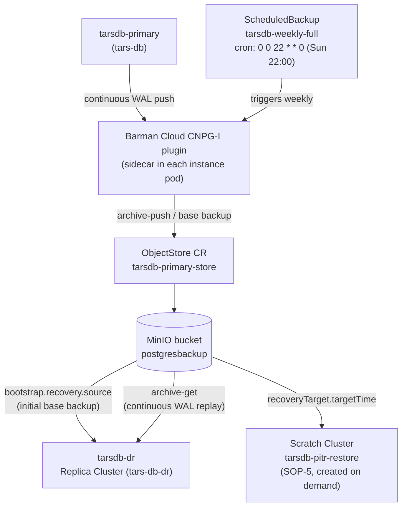

# 02 — Backup, PITR & Disaster Recovery Theory

## Why object-storage-based backup instead of just streaming replication

Streaming replication alone protects you against a **node failure** (primary dies, promote a
replica) but not against **logical corruption** — a bad `DELETE`, a botched migration, ransomware,
an app bug that silently corrupts rows. A replica faithfully replicates that mistake in
milliseconds. You need an independent, time-addressable copy of the data: base backups plus a
continuous WAL archive, so you can restore to any point in time *before* the mistake.

This is exactly what pgBackRest does for TARS and what Barman Cloud does for CNPG:

- **Base backup** — a full physical copy of the data directory at some point in time.
- **Continuous WAL archiving** (`archive_command` in TARS → the Barman Cloud CNPG-I plugin) — every
  completed WAL segment is pushed to the object store the moment it's closed.
- **Point-in-time recovery (PITR)** — restore the base backup, then replay archived WAL forward to
  any target LSN/timestamp you choose, up to (but not including) the corrupting transaction.

## Retention policy in this build

Mirroring TARS's `repo1-retention-full: 7` / `repo2-retention-full: 7` (time-based, 7 days) and
its "PITR to any moment within the two-week retention window" language, this SOP configures:

- Full backup: **weekly**, scheduled via CNPG `ScheduledBackup` using the Barman Cloud CNPG-I plugin.
- Retention: **14 days**, matching the TARS PITR window statement in section 4.1 of the source doc.
- WAL: retained continuously alongside backups so any point inside the retention window is
  reachable, not just the full-backup boundaries.

Tighten or loosen `retentionPolicy` in `manifests/backup/objectstore-primary.yaml` to match your real
RPO/compliance requirements — 14 days is a starting point taken from the TARS reference doc, not a
universal default.

## Module diagram

## DR architecture: replica cluster, not just "another replica"

A same-`Cluster` replica (the second pod inside `tarsdb-primary`) streams directly from the
primary over the network and is meant for **local HA** — fast, automatic failover, same site/AZ.

A **replica cluster** (`tarsdb-dr`, a wholly separate `Cluster` object in its own namespace) is
CNPG's DR primitive:

- It does **not** stream directly from the primary. It bootstraps from the object store
  (`bootstrap.recovery.source`) and then continuously fetches/replays WAL from that same object
  store (`replica.enabled: true`, `replica.source` pointing at the `externalClusters` entry).
- This matches the TARS diagram precisely: Site 2's standby "replays WAL from repo2" via
  `archive-get`, it is *not* shown streaming directly from Site 1's primary.
- Because it depends only on the object store, DR keeps working even if the network path between
  primary and DR site is down — as long as both sides can reach the (replicated/durable) bucket.

## Fencing and split-brain prevention

Never promote `tarsdb-dr` while `tarsdb-primary` might still be accepting writes. If both become
writable against divergent WAL histories, you get a split-brain: two valid-looking timelines that
cannot be automatically merged, and one side's data will have to be discarded. The runbook in
`04-runbooks-sop.md` makes the "confirm primary is fenced/stopped first" step explicit and
manual, exactly as TARS section 4.1 specifies.

## Failback

After a DR promotion, the *former* primary site is never simply restarted in place — its disk may
contain writes the (now-promoted) DR primary never saw, or it may be behind. The correct sequence
(again mirroring TARS section 4.1):

1. Wipe/re-provision the old primary's `Cluster` as a **new replica cluster** pointed at the
   (now-authoritative) promoted cluster's backup object store.
2. Let it fully resynchronize via base-backup bootstrap + WAL replay.
3. Only once caught up, perform a controlled **failback**: flip roles again (promote the
   resynchronized original site, demote the interim primary back to replica-cluster mode) during
   a planned maintenance window — not a hot cutover.
