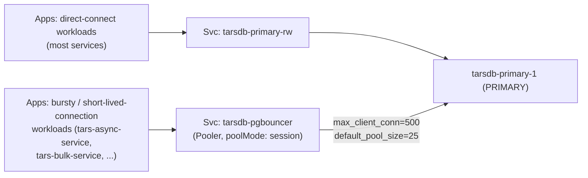

# 03 — Connection Pooling Theory (pgBouncer via CNPG Pooler)

## Why pool at all

Each PostgreSQL backend is a full OS process with its own memory (catalog cache, work_mem
allocations, etc.). TARS runs `max_connections=250`; this POC reduces it to `max_connections=50`
(see cluster-primary.yaml) to avoid OOM on an 8GB laptop, so the connection-monitor's alert
threshold and `WATCH_DATABASES` are computed from 50, not 250 — see the "Connection threshold
alerting theory" section below. Either way, `max_connections` is a hard ceiling — every
connection above it is refused outright, and even well below it, thousands of short-lived
app-side connections opening/closing constantly is expensive (backend fork/exit cost, connection
storms after a network blip). A pooler sits in front, holds a small number of real backend
connections open, and multiplexes many client connections onto them.

## Module diagram

## Pool modes — why `session` (matching TARS)

- **session** (chosen here): a client keeps its backend connection for the lifetime of its
  session. Safest — fully compatible with session-level features (prepared statements, advisory
  locks, `SET` session variables, temp tables) — but pools the least aggressively.
- **transaction**: backend is returned to the pool between transactions, not between client
  sessions. Much higher effective concurrency, but breaks anything that depends on session state
  persisting across statements outside a single transaction.
- **statement**: most aggressive, breaks multi-statement transactions entirely.

TARS uses `session` mode — this build matches it. If you later need higher fan-in (e.g. a
serverless/Lambda-style workload opening thousands of short connections), revisit
`transaction` mode per-database, but audit for session-state dependencies first.

## Direct-to-primary vs. via-pooler — TARS's dual-path pattern

The TARS connection matrix (section 9 of the PDF) shows two connection styles:

- Hosts starting `tarsdb-primary...` → connect **directly** to the primary service. Used by
  most application workloads.
- Hosts starting `tarsdb-pgbouncer...` → connect **through the pooler**. Used selectively — e.g.
  `tars-async-service`, `tars-bulk-service`, `tars-pdf-gen`, `tars-userinfo` — services explicitly
  capped with per-connection `max_connections=N` hints in the matrix, i.e. services whose
  connection *behavior* (bursty, many short-lived connections) is what pooling is meant to fix.

This build reproduces that pattern: the CNPG `Cluster` primary service (`tarsdb-primary-rw`) is
reachable directly, and the `Pooler` service (`tarsdb-pgbouncer` — no `-rw` suffix; a `Pooler`'s
Service takes the `Pooler` object's own name) is a separate, optional path — you point specific
applications at whichever one matches their connection profile, exactly as TARS's matrix does
per-workload rather than forcing everything through the pooler.

## TLS

TARS terminates client TLS at pgBouncer (`client_tls_sslmode: require`) and re-encrypts to the
backend with full certificate verification (`server_tls_sslmode: verify-full`) — i.e. TLS is
never dropped anywhere in the path. This build's `Pooler` manifest is annotated for TLS and the
runbook explains where to plug in your real CA/cert secrets; it ships with TLS scaffolding rather
than self-signed throwaway certs, since pooler TLS config is inherently environment-specific
(your CA, your cert lifecycle).

## Connection threshold alerting theory

TARS alerts at ~68% of `max_connections` (170/250 in TARS's own sizing) rather than at the hard
ceiling, because by the time you hit the ceiling, new connections are already failing — the alert
needs enough lead time for a human (or an automated idle-reaper) to act before outage. This build
reproduces both halves of that TARS control:

1. A **soft-threshold alert** (same 68% ratio, computed from whatever `max_connections` you set —
   34/50 in this POC's reduced profile; see `manifests/monitoring/conn-monitor-cronjob.yaml`'s
   `MAX_CONNECTIONS` env var, which must stay in sync with `cluster-primary.yaml`'s
   `max_connections` if you change either) that emails/logs when sustained connections exceed it.
2. An **idle-session reaper** (TARS: "idle for more than 5 minutes") that proactively terminates
   idle-in-session backends before they contribute to the ceiling in the first place — treating
   the threshold alert as a backstop, not the primary control.
