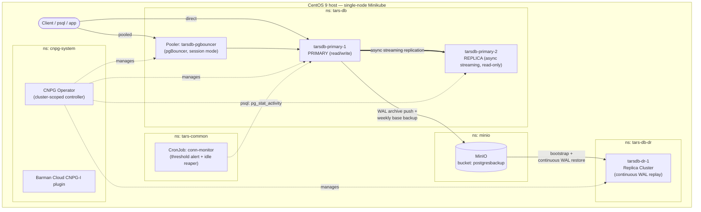
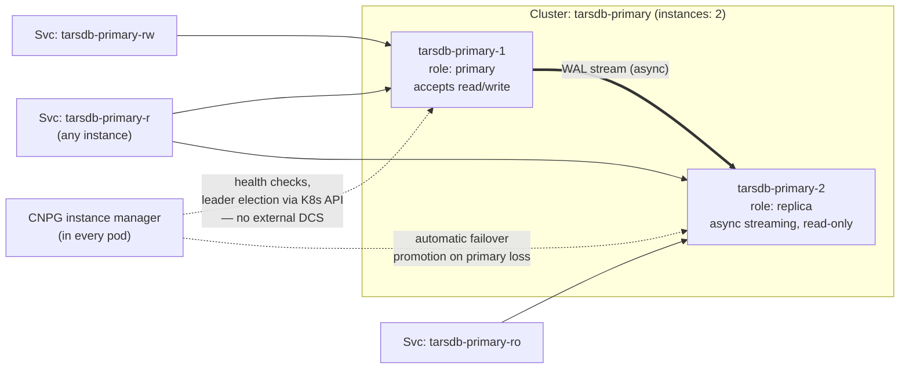
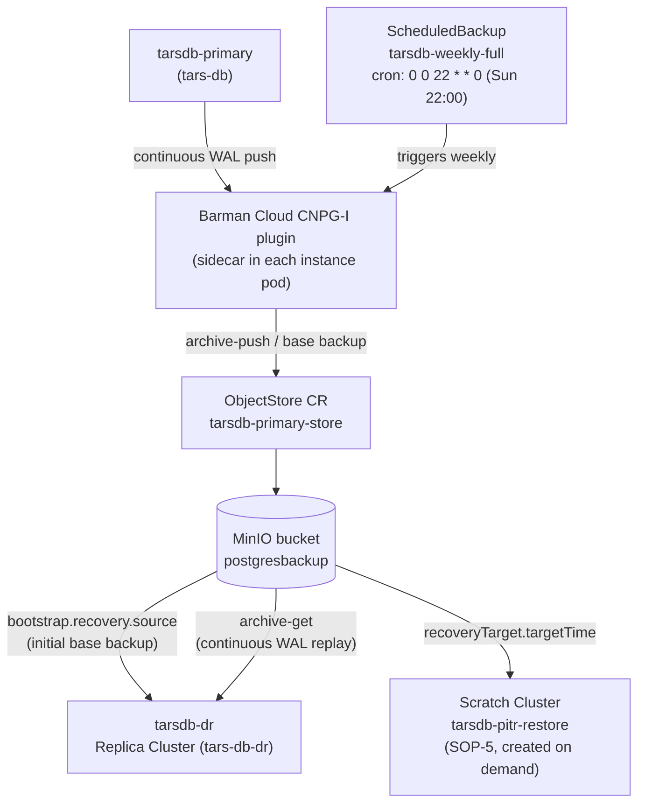
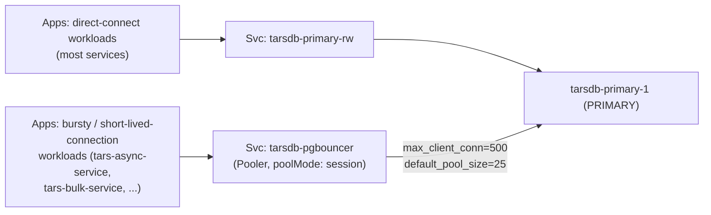
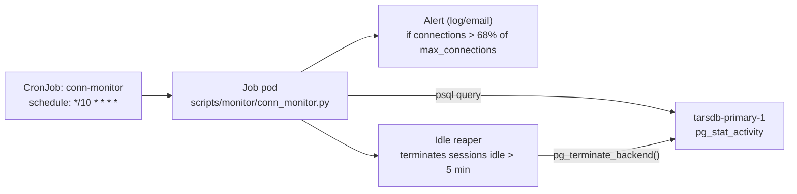
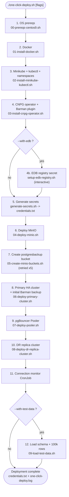
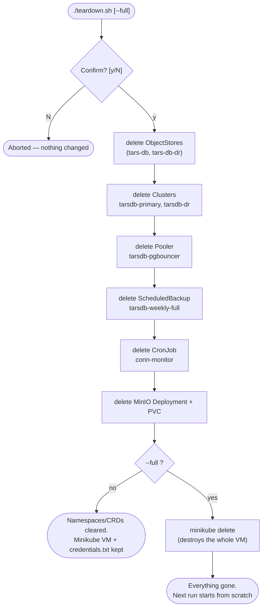

# 06 — Architecture Diagrams (per module)

All diagrams are [Mermaid](https://mermaid.js.org/) and render natively on GitHub/GitLab. If your
viewer doesn't render Mermaid, paste the block into <https://mermaid.live>.

This doc complements the theory docs (`01`–`03`) and the SOPs (`04`) with one diagram per module,
plus the two operational flows (`one-click-deploy.sh` and `teardown.sh`) laid out as flowcharts so
you can see exactly what each command does before you run it.

---
## 1. Full system topology

Everything below runs inside a **single Minikube node**, split across four namespaces
(`cnpg-system`, `tars-db`, `tars-db-dr`, `minio`, `tars-common`). This is the picture to hold in
your head for the whole POC.

**Read it as:** one primary accepting writes, one same-site async replica for fast local failover,
a pooler in front for bursty workloads, everything continuously backed up to MinIO, and a
second `Cluster` (`tarsdb-dr`) in its own namespace that treats that same MinIO bucket as its
*only* source of truth — it never talks to the primary directly. See `docs/02-backup-dr-theory.md`
for why that matters.

---
## 2. Module: Primary HA cluster (`tarsdb-primary`)

`-rw` always points at the current primary (follows failover), `-ro` always points at replicas
only, `-r` load-balances across any ready instance. Point read-heavy/reporting workloads at `-ro`.

---
## 3. Module: Backup & DR (Barman Cloud + MinIO + replica cluster)

Retention is 14 days, matching the TARS PITR window (`docs/02-backup-dr-theory.md`). The DR
cluster's link to the primary is **entirely through the bucket** — it has no network path to
`tarsdb-primary` at all, which is exactly what makes it survive a primary-site network outage.

---
## 4. Module: Connection pooling (pgBouncer via CNPG `Pooler`)

Two independent paths to the same primary — pick per-workload, exactly like TARS's connection
matrix (`docs/03-connection-pooling-theory.md`). Pooling is opt-in per app, not a mandatory proxy
in front of everything.

---
## 5. Module: Connection monitoring (threshold alert + idle reaper)

68% is TARS's own alert ratio (170/250 in TARS's sizing), recomputed here against this POC's
reduced `max_connections=50` — see `docs/03-connection-pooling-theory.md`'s alerting section for
why the threshold is set below the hard ceiling instead of at it.

---
## 6. Flow: `./one-click-deploy.sh` (setup)

Every step is idempotent (`kubectl apply` or an existence check first), so re-running after a
partial failure resumes rather than duplicates work — see "One-click deploy" in the README.

---
## 7. Flow: `./teardown.sh [--full]`

**Known gap:** every delete in the flow above is a live `kubectl` call, so `teardown.sh` needs a
*reachable* API server. If Minikube itself is already `Stopped` (not just idle), `kubectl` can't
connect and the script exits immediately on the first delete (it runs under `set -euo pipefail`).
In that state, skip straight to `minikube delete` (or `minikube start` first if you want the
resource-by-resource teardown log) — see "Troubleshooting" in the README.
